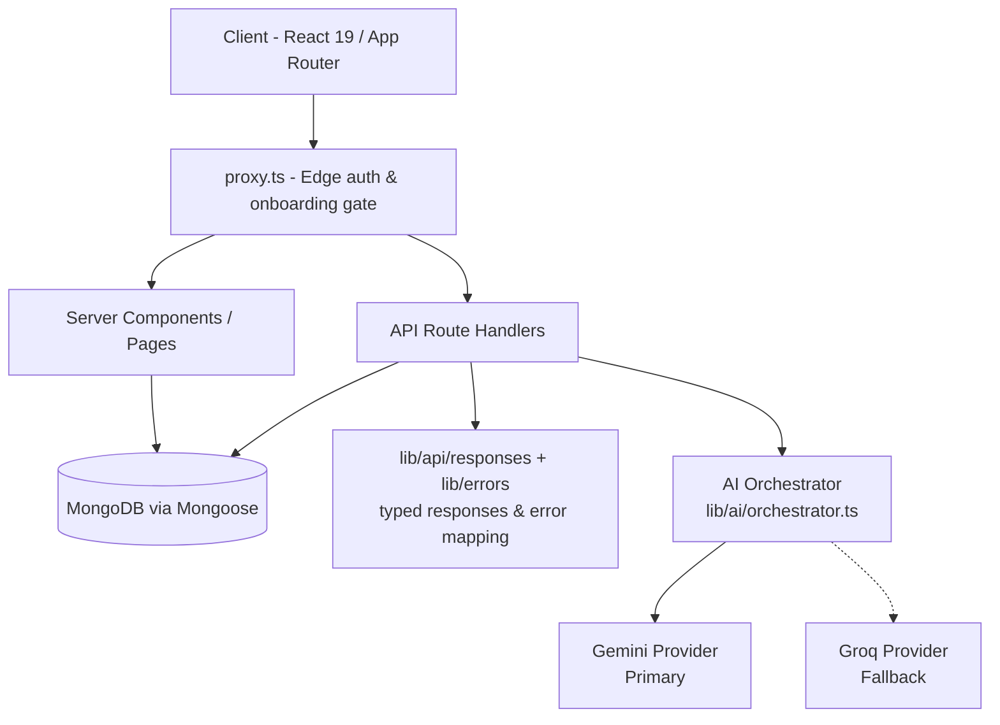
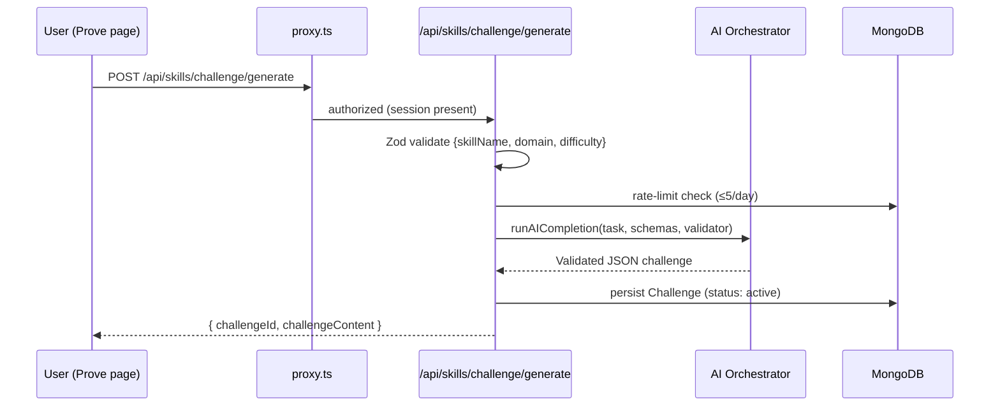
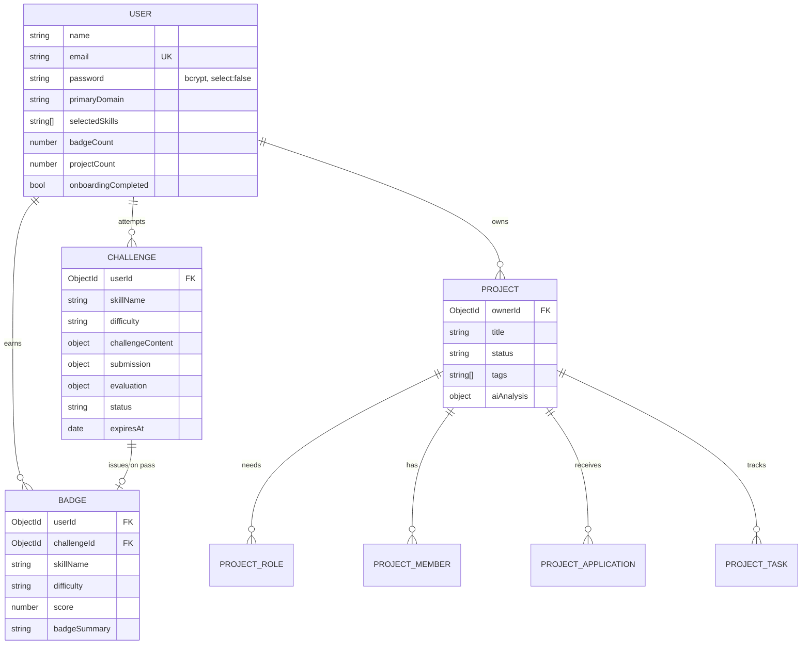
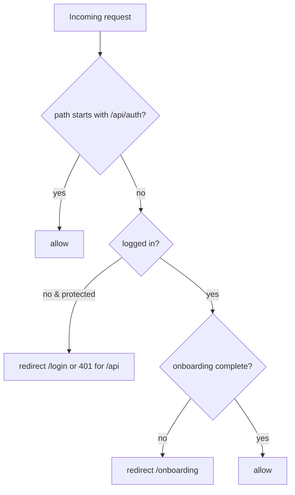
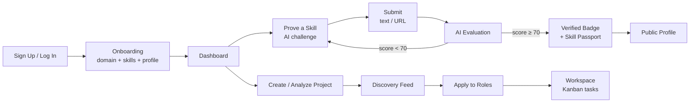

<div align="center">

# ⚡ SkillSync

### Prove Your Skills. Find Your Builders.

**Stop self-reporting skills nobody believes.** SkillSync uses AI to generate real-world challenges, verify your work, issue trustworthy badges, and assemble project teams from builders whose skills are actually proven.

<br/>


</div>

---

## 📑 Table of Contents

- [Overview](#-overview)
- [Key Features](#-key-features)
- [Screenshots](#-screenshots)
- [Tech Stack](#-tech-stack)
- [Project Architecture](#-project-architecture)
- [Folder Structure](#-folder-structure)
- [Installation](#-installation)
- [Environment Variables](#-environment-variables)
- [Running Locally](#-running-locally)
- [Deployment](#-deployment)
- [Database Models](#-database-models)
- [Authentication](#-authentication)
- [API Documentation](#-api-documentation)
- [AI Features](#-ai-features)
- [User Workflow](#-user-workflow)
- [Development Workflow](#-development-workflow)
- [Scripts](#-scripts)
- [Performance](#-performance)
- [Security](#-security)
- [Implementation Status](#-implementation-status)
- [Future Improvements](#-future-improvements)
- [Contributing](#-contributing)
- [License](#-license)
- [Credits](#-credits)

---

## 🧭 Overview

**SkillSync** is an AI-powered skill-verification and team-building platform built with the Next.js App Router.

| | |
|---|---|
| **What it does** | Generates unique, real-world challenges for a chosen skill, evaluates submissions with AI against a professional rubric, issues verified badges with a proof artifact, and helps users start projects and recruit teammates based on *verified* skills. |
| **The problem it solves** | Résumés and self-reported skill lists are unverifiable and easy to inflate. SkillSync replaces "trust me" with "here's my proof." |
| **Who it's for** | Students, early-career developers, designers, writers, marketers, and analysts who want credible, demonstrable proof of skill — and founders looking for co-builders they can trust. |
| **Why it's different** | Real, AI-generated tasks (not multiple-choice quizzes), a transparent scoring rubric, and a **provider-agnostic AI orchestrator**: featuring automatic failover between **Google Gemini** (Primary) and **Groq** (Fallback) to ensure 99.9% uptime. |

The aesthetic is a dark-mode-first "Midnight Craft" design system — Syne display headings, a mint/teal primary, amber accent, and violet AI accent — with Framer Motion micro-interactions throughout.

---

## ✨ Key Features

### 🔐 Authentication & Onboarding
- Email/password (credentials) and **Google OAuth** sign-in via NextAuth v5
- JWT session strategy with custom token enrichment (`id`, `primaryDomain`, `onboardingCompleted`)
- Edge-runtime route protection and an onboarding gate via `proxy.ts`
- Multi-step onboarding: pick a primary domain → select skills → complete profile

### 🤖 AI Skill Verification
- **Challenge generation** — Gemini/Groq crafts a unique, industry-grade task tailored to skill + difficulty
- **AI evaluation** — Gemini/Groq scores submissions on a 100-point rubric (Completeness, Quality, Accuracy, Depth) with a 70 pass threshold
- **Fake-streaming reveal** — challenge text types in word-by-word for a live-AI feel
- Daily generation rate limit (5/day per user) and 7-day challenge expiry

### 🏅 Verified Badges & Skill Passport
- Passing a challenge issues a `Badge` with score, difficulty, and a one-line proof summary
- Public profile renders a "Skill Passport" grid of verified badges

### 🧩 Project Collaboration
- **AI project analysis** — Gemini turns a plain-language idea into a summary, problem statement, target outcome, complexity, tags, and the specific roles a team needs
- Project creation, a discovery feed with skill/status/search filters, and "matches your skills" highlighting
- Role applications (apply with a message), team membership, and a **Kanban workspace** with click-to-advance tasks

### 👤 Profiles & Dashboard
- Public profile (badges, projects, avg score) with private challenge-attempt stats for the owner
- Dashboard with greeting, stats (badges / projects / avg score), skill passport, active projects, quick actions, and recommended projects

### 🎨 UX
- Reusable scroll-reveal + stagger animation primitives, skeleton loading states, responsive sidebar with mobile sheet, and `prefers-reduced-motion` support

---

## 📸 Screenshots

> Add screenshots to `docs/images/` and they will render below. Suggested captures:

| Screen | Path |
|---|---|
| Landing page | `docs/images/landing.png` |
| Dashboard | `docs/images/dashboard.png` |
| Prove a Skill | `docs/images/prove.png` |
| Evaluation Results / Badge | `docs/images/result.png` |
| Project Discovery | `docs/images/discover.png` |
| Project Workspace (Kanban) | `docs/images/workspace.png` |
| Public Profile | `docs/images/profile.png` |

```text
docs/
└── images/
    ├── landing.png
    ├── dashboard.png
    └── ...
```

---

## 🛠 Tech Stack

### Frontend
| Tech | Version | Purpose |
|---|---|---|
| Next.js (App Router) | `16.2.9` | Framework, routing, RSC, API routes |
| React | `19.2.4` | UI library |
| TypeScript | `^5` | Type safety |
| Tailwind CSS | `^4` | Utility-first styling |
| Framer Motion | `^12` | Animations & micro-interactions |
| Radix UI / shadcn | `^1.6` / `^4` | Accessible UI primitives |
| lucide-react | `^1.21` | Icon set |
| sonner | `^2` | Toast notifications |
| next-themes / tw-animate-css | — | Theming & animation utilities |

### Backend & Data
| Tech | Version | Purpose |
|---|---|---|
| Next.js Route Handlers | `16` | REST API endpoints |
| MongoDB + Mongoose | `^9.7` | Database & ODM |
| Zod | `^4` | Runtime input/response validation |
| bcryptjs | `^3` | Password hashing |

### Authentication
| Tech | Purpose |
|---|---|
| NextAuth (Auth.js) `^5.0.0-beta` | Credentials + Google OAuth, JWT sessions |
| `@auth/mongodb-adapter` | MongoDB adapter (installed) |

### AI
| Provider | SDK | Used for |
|---|---|---|
| AI Orchestrator | Internal Abstraction | Unifies all AI requests, parses responses, runs semantic validation, and handles failovers. |
| Google Gemini (Primary) | `@google/genai` `^0.1.2` | Primary engine for Generation, Evaluation, and Project Analysis. |
| Groq (Fallback) | `openai` `^6.45.0` | Fallback engine using Llama 3 when Gemini is unavailable. |

### Services & Tooling
| Tech | Purpose |
|---|---|
| Cloudinary / next-cloudinary | Image hosting/transforms (configured) |
| Resend | Transactional email (configured) |
| Vercel | Deployment target (`vercel.json`) |
| ESLint (`eslint-config-next`) | Linting |
| Package manager | **npm** (`package-lock.json`) |

---

## 🏗 Project Architecture

SkillSync is a single Next.js application that serves both the UI (Server + Client Components) and the API (Route Handlers), backed by MongoDB and two AI providers.



**Request lifecycle (example: generate a challenge)**



---

## 📂 Folder Structure

> Generated build artifacts (`.next/`), `node_modules/`, and IDE config are omitted.

```text
skillsync/
├── app/                         # App Router: pages, layouts, API routes
│   ├── (app)/                   # Authenticated app (sidebar shell)
│   │   ├── layout.tsx           # Auth guard + responsive sidebar
│   │   ├── template.tsx         # Per-navigation fade transition
│   │   ├── dashboard/           # Dashboard (server component)
│   │   ├── profile/[id]/        # Public profile + loading skeleton
│   │   ├── projects/            # create / discover / [id] / [id]/workspace
│   │   └── skills/              # prove / result/[challengeId]
│   ├── (auth)/                  # login / signup / onboarding / forgot-password
│   ├── api/                     # Route Handlers (REST)
│   │   ├── auth/                # NextAuth handlers + register
│   │   ├── projects/            # list/create, [id], apply, tasks, analyze
│   │   ├── skills/challenge/    # generate, [challengeId]/submit
│   │   └── users/               # me, [id]
│   ├── globals.css              # Design tokens, keyframes, utilities
│   ├── layout.tsx               # Root layout + SEO/OG metadata
│   └── page.tsx                 # Landing page
├── components/                  # Reusable UI, organized by feature
│   ├── auth/                    # AuthPanel
│   ├── landing/                 # LandingContent
│   ├── layout/                  # Sidebar, MobileTopBar, Navigation
│   ├── onboarding/              # DomainGrid, SkillPills
│   ├── profile/                 # ProfileExperience
│   ├── projects/                # ProjectFeedCard, RoleCard, TaskCard
│   ├── shared/                  # AnimatedSection, StaggerContainer, ScoreRing, cards…
│   ├── skills/                  # ResultExperience
│   ├── ui/                      # shadcn/Radix primitives (button, dialog, sheet…)
│   └── providers.tsx            # SessionProvider + Toaster
├── lib/                         # Business logic, AI clients, helpers
│   ├── ai/                      # orchestrator.ts, config.ts, metrics.ts, parse.ts, providerRegistry.ts
│   ├── api/                     # responses.ts (success/error envelope)
│   ├── prompts/                 # challenge.ts, evaluation.ts (system prompts + schemas)
│   ├── constants.ts             # Domains & SKILLS_BY_DOMAIN map
│   ├── errors.ts                # Typed AppError hierarchy
│   ├── logger.ts                # Structured JSON logger
│   ├── mongodb.ts               # Cached Mongoose connection
│   ├── profile.ts               # Aggregated public-profile data
│   ├── validations.ts           # Zod schemas
│   └── utils.ts                 # cn() + helpers
├── models/                      # Mongoose schemas
│   ├── User.ts  Badge.ts  Challenge.ts  Project.ts
├── scripts/
│   └── seed.ts                  # Demo data seeder (tsx)
├── types/                       # next-auth.d.ts (session augmentation), index.ts
├── auth.ts                      # NextAuth (Node) — providers, callbacks
├── auth.config.ts               # Edge-safe NextAuth config (used by proxy)
├── proxy.ts                     # Edge middleware: route protection + onboarding gate
├── next.config.ts               # Image remote patterns, env exposure
├── vercel.json                  # Function maxDuration + security headers
└── tailwind.config.ts / postcss.config.mjs / tsconfig.json / eslint.config.mjs
```


---

## 🚀 Installation

```bash
# 1. Clone the repository
git clone https://github.com/Deep-2308/SkillSync-2.0.git
cd SkillSync-2.0/skillsync

# 2. Install dependencies (npm)
npm install

# 3. Create your environment file
cp .env.example .env.local
#   (Windows PowerShell)  Copy-Item .env.example .env.local

# 4. Fill in .env.local (see Environment Variables below)

# 5. (Optional) Seed demo data
npx tsx scripts/seed.ts

# 6. Start the dev server
npm run dev
```

App runs at **http://localhost:3000**.

> **Requirements:** Node.js `20.9+` (Next.js 16 / React 19), a MongoDB connection string, and the API keys below.

---

## 🔑 Environment Variables

All variables live in `.env.local` (never commit it). Source of truth: [`.env.example`](./.env.example).

| Variable | Required | Description |
|---|:---:|---|
| `MONGODB_URI` | ✅ | MongoDB connection string (Atlas or local). |
| `NEXTAUTH_SECRET` | ✅ | Session/JWT signing secret. Generate with `openssl rand -hex 32`. |
| `NEXTAUTH_URL` | ✅ | App base URL (e.g. `http://localhost:3000`). |
| `GOOGLE_CLIENT_ID` | ✅* | Google OAuth client id (*required for Google sign-in). |
| `GOOGLE_CLIENT_SECRET` | ✅* | Google OAuth client secret. |
| `GOOGLE_GENAI_API_KEY` | ✅ | Google Gemini key — primary AI provider. |
| `GROQ_API_KEY` | ✅ | Groq key — fallback AI provider. |
| `NEXT_PUBLIC_CLOUDINARY_CLOUD_NAME` | ⬜ | Cloudinary cloud name (image hosting). |
| `CLOUDINARY_API_KEY` | ⬜ | Cloudinary API key. |
| `CLOUDINARY_API_SECRET` | ⬜ | Cloudinary API secret. |
| `RESEND_API_KEY` | ⬜ | Resend key for transactional email. |
| `NEXT_PUBLIC_APP_URL` | ✅ | Public base URL (used in metadata & share links). |

**Optional AI generation tuning** (defaults shown in `.env.example`):

| Variable | Default | Notes |
|---|---|---|
| `PRIMARY_AI_PROVIDER` | `gemini` | Choose `gemini` or `groq`. |
| `FALLBACK_AI_PROVIDER` | `groq` | Used automatically if the primary provider fails. |
| `GEMINI_GENERATION_MODEL` | `gemini-2.5-pro` | Model used for challenge generation. |
| `GEMINI_EVALUATION_MODEL` | `gemini-2.5-pro` | Model used for evaluating submissions. |
| `GEMINI_TIMEOUT_MS` | `20000` | Transport timeout per request. |

---

## 💻 Running Locally

<details>
<summary><b>1. MongoDB</b></summary>

- Create a free **MongoDB Atlas** cluster (or run MongoDB locally).
- Copy the connection string into `MONGODB_URI` (include the `skillsync` database name).
- The connection is cached across hot reloads in `lib/mongodb.ts`.
</details>

<details>
<summary><b>2. Google OAuth</b></summary>

- Go to **Google Cloud Console → APIs & Services → Credentials**.
- Create an **OAuth 2.0 Client ID** (Web application).
- Authorized redirect URI (dev): `http://localhost:3000/api/auth/callback/google`.
- Set `GOOGLE_CLIENT_ID` and `GOOGLE_CLIENT_SECRET`.
</details>

<details>
<summary><b>3. AI Keys</b></summary>

- **Gemini:** create a key in Google AI Studio → `GOOGLE_GENAI_API_KEY`.
- **Groq:** create a key in the Groq Console → `GROQ_API_KEY`.
</details>

<details>
<summary><b>4. Cloudinary & Resend (optional)</b></summary>

- Cloudinary: set the cloud name + key/secret for image hosting (avatars use `lh3.googleusercontent.com` / `res.cloudinary.com`, allowed in `next.config.ts`).
- Resend: set `RESEND_API_KEY` for email features.
</details>

<details>
<summary><b>5. Seed & run</b></summary>

```bash
npx tsx scripts/seed.ts   # 15 demo users, badges, 4 projects + tasks
npm run dev
# Demo login: aarav.shah@email.com / Password123!
```
</details>

---

## ☁️ Deployment

Configured for **Vercel** (`vercel.json` sets `maxDuration: 30s` for `app/api/**` and adds security headers).

1. **Push** to GitHub and import the repo into Vercel.
2. **Set environment variables** (all of the above) in Vercel → Project → Settings → Environment Variables.
3. **Production build:** `npm run build` → `npm run start` (Vercel runs these automatically).
4. **Domain & `NEXTAUTH_URL` / `NEXT_PUBLIC_APP_URL`:** update to your production URL.
5. **Google OAuth redirect URI:** add `https://<your-domain>/api/auth/callback/google`.
6. **MongoDB:** allow Vercel egress IPs (or `0.0.0.0/0` for Atlas dev) and use a production cluster.
7. **Cloudinary/Resend:** add production keys if those features are enabled.

```bash
npm run build   # production build
npm run start   # serve the build
```

---

## 🗄 Database Models

Four Mongoose models (`models/`). Relationships are by `ObjectId` reference.



| Model | Key fields | Notes |
|---|---|---|
| **User** | `email` (unique), `password` (`select:false`), `primaryDomain`, `selectedSkills` (≤8), `badgeCount`, `projectCount`, `onboardingCompleted`, `bio`, `githubUrl`, `portfolioUrl` | `toPublicJSON()` strips sensitive fields. |
| **Badge** | `userId`, `challengeId` (required), `skillName`, `domain`, `difficulty`, `score`, `badgeSummary`, `issuedAt` | One per passed challenge. |
| **Challenge** | `challengeContent` (title/context/requirements/deliverables/evaluationCriteria/estimatedMinutes), `submission`, `evaluation` (score, passed, scoreBreakdown, feedback, strengths, improvements, badgeSummary), `status` (`active`→`evaluated`), `expiresAt` (7 days) | Drives the prove → evaluate loop. |
| **Project** | `roles[]` (title, requiredSkills, importance, isFilled, assignedUserId), `members[]`, `applications[]`, `tasks[]` (status `todo`/`in-progress`/`done`), `aiAnalysis`, `status` (`recruiting`/`building`/`completed`/`abandoned`) | Embedded subdocuments for team, tasks, applications. |

---

## 🔒 Authentication

- **Library:** NextAuth (Auth.js) v5 beta, **JWT** session strategy.
- **Providers:** `Credentials` (email/password, bcrypt-compared) and **Google OAuth**. Google accounts are upserted into MongoDB on first sign-in.
- **Session augmentation** (`types/next-auth.d.ts`): `session.user` carries `id`, `primaryDomain`, and `onboardingCompleted`.
- **Edge split:** `auth.config.ts` is Edge-safe (no DB/bcrypt) and consumed by `proxy.ts`; `auth.ts` holds the DB-aware Credentials provider, Google upsert, and JWT enrichment.

**Route protection & onboarding gate (`proxy.ts`):**



- Protected prefixes: `/dashboard`, `/skills`, `/profile/settings`, `/projects/create`, and **all `/api/*` except `/api/auth/*`** (which return `401 JSON` when unauthenticated).
- Authenticated users are redirected away from `/login` and `/signup`; onboarded users are redirected away from `/onboarding`.

---

## 📡 API Documentation

Base path: `/api`. Unless noted, endpoints require an authenticated session (enforced by `proxy.ts` and re-checked in handlers). Errors use a consistent JSON envelope via `lib/api/responses.ts` + `lib/errors.ts` (`401` Unauthorized, `400` Validation/precondition, `403` Forbidden, `404` Not Found, `429` Rate limit, `5xx` AI/service).

### Auth
| Method | Path | Purpose |
|---|---|---|
| `POST` | `/api/auth/register` | Create a credentials account (name, email, password). |
| `GET/POST` | `/api/auth/[...nextauth]` | NextAuth flows (sign-in, callback, session, signout). |

### Users
| Method | Path | Auth | Purpose |
|---|---|:---:|---|
| `GET` | `/api/users/me` | ✅ | Current user's public profile (`toPublicJSON`). |
| `PATCH` | `/api/users/me` | ✅ | Update onboarding profile (domain, skills, bio, links). |
| `GET` | `/api/users/[id]` | ✅ | Public profile + `badges` + `projects` (+ `privateStats` if self). |

### Skills / Challenges
| Method | Path | Auth | Purpose |
|---|---|:---:|---|
| `POST` | `/api/skills/challenge/generate` | ✅ | Generate an AI challenge. Rate-limited 5/day. |
| `POST` | `/api/skills/challenge/[challengeId]/submit` | ✅ (owner) | Submit text/URL → AI evaluation → badge if `score ≥ 70`. |

<details>
<summary><b>Example — POST /api/skills/challenge/generate</b></summary>

```jsonc
// Request
{ "skillName": "React", "domain": "Frontend Dev", "difficulty": "intermediate" }

// 201 Response
{
  "success": true,
  "challengeId": "…",
  "challengeContent": {
    "title": "…", "context": "…",
    "requirements": ["…","…","…","…"],
    "deliverables": ["…"], "evaluationCriteria": ["…","…","…"],
    "estimatedMinutes": 35
  }
}
```
Errors: `401` unauthorized · `400` validation · `429` daily limit · `500` AI invalid/service.
</details>

### Projects
| Method | Path | Auth | Purpose |
|---|---|:---:|---|
| `GET` | `/api/projects` | ✅ | Discovery feed. Query: `status` (default `recruiting`), `skill`, `page`, `limit`. Returns `{ projects, total, page, hasMore }`. |
| `POST` | `/api/projects` | ✅ | Create a project (adds creator as first member, `$inc` projectCount). |
| `GET` | `/api/projects/[id]` | ✅ | Full project (populated owner/members/applications) + `badgesByUser`. |
| `POST` | `/api/projects/[id]/apply` | ✅ | Apply for a role (`{ roleId, message }`, ≥20 chars). |
| `GET/POST/PATCH` | `/api/projects/[id]/tasks` | ✅ (member) | List / create / update Kanban tasks. |
| `POST` | `/api/projects/analyze` | ✅ | **Gemini** analysis of an idea → summary, complexity, tags, roles. |

<details>
<summary><b>Example — POST /api/projects/analyze</b></summary>

```jsonc
// Request
{ "title": "…", "description": "…", "ownerRole": "Frontend Developer" }

// 200 Response
{
  "success": true,
  "analysis": {
    "summary": "…", "problemStatement": "…", "targetOutcome": "…",
    "estimatedDuration": "4-6 weeks", "complexity": "medium",
    "tags": ["…"],
    "roles": [{ "title": "…", "description": "…", "requiredSkills": ["…"], "importance": "…" }]
  }
}
```
</details>

---

## 🧠 AI Features

SkillSync uses a **provider-agnostic AI architecture** that guarantees high availability and reliable JSON generation.

| Agent | Configurable Model Env | Entry point |
|---|---|---|
| **Challenge generator** | `GEMINI_GENERATION_MODEL` | `POST /api/skills/challenge/generate` |
| **Submission evaluator** | `GEMINI_EVALUATION_MODEL` | `POST /api/skills/challenge/[id]/submit` |
| **Project analyzer** | `GEMINI_PROJECT_ANALYSIS_MODEL` | `POST /api/projects/analyze` |

**The Orchestrator (`lib/ai/orchestrator.ts`):**
- **Dynamic Failover**: Attempts the `PRIMARY_AI_PROVIDER` first (e.g., Gemini 2.5 Pro). If it times out or throws an error, it immediately falls back to the `FALLBACK_AI_PROVIDER` (e.g., Groq Llama 3) for the exact same prompt, guaranteeing 99.9% uptime.
- **Two-Stage Validation**: 
  1. **Zod Validation**: Ensures the response perfectly matches the target schema (`lib/ai/parse.ts`).
  2. **Semantic Validation**: Each route provides custom assertions (e.g., "challenge feedback cannot be empty"). 
  - A failure in *either* stage triggers an automatic failover.
- **Metrics Observability**: Every request emits structured metrics tracking `latency`, `inputTokens`, `outputTokens`, `requestId`, and `failedOver` status.

**Scoring rubric (evaluation):** Completeness (25) · Quality (30) · Accuracy (25) · Depth (20) → pass at **70/100** (pass is derived server-side from the score).

---

## 🧑‍💻 User Workflow



---

## 🔧 Development Workflow

**Conventions**
- **Path alias:** `@/*` → project root (`tsconfig.json`).
- **Server vs Client:** prefer Server Components; add `"use client"` only when interactivity/hooks are needed.
- **Validation everywhere:** all API inputs and AI outputs are validated with **Zod**.
- **Errors:** `throw` a typed `AppError` (`lib/errors.ts`) and let `handleApiError()` map it to a response.
- **Design tokens:** style with the CSS variables/utilities in `app/globals.css` and `.kiro/steering/design-workflow.md` — never hardcode hex in components.

**Add an API route**
1. Create `app/api/<resource>/route.ts` (or `[id]/route.ts`).
2. `auth()` for protected routes; parse the body with a Zod schema.
3. `await dbConnect()`, perform the Mongoose operation.
4. Return via `successResponse(...)`; wrap logic in `try/catch` → `handleApiError(...)`.

**Add a database model**
1. Create `models/<Name>.ts` with an interface + `Schema` and the `mongoose.models.X || mongoose.model(...)` guard.
2. Reference related docs by `ObjectId` and add indexes for hot queries.

**Add an AI prompt**
1. Add a builder + Zod response schema in `lib/prompts/`.
2. Call `runAICompletion()` from the orchestrator and supply a `semanticValidator`.

---

## 📜 Scripts

| Script | Command | Description |
|---|---|---|
| `dev` | `next dev` | Start the dev server (Turbopack) at `:3000`. |
| `build` | `next build` | Production build. |
| `start` | `next start` | Serve the production build. |
| `lint` | `eslint` | Lint the codebase (`eslint-config-next`). |
| seed | `npx tsx scripts/seed.ts` | Seed demo users, badges, projects & tasks (not a package.json script). |

---

## ⚡ Performance

- **Server Components by default** — data fetching (dashboard, profile, project detail) runs on the server; client bundles are kept lean.
- **Cached DB connection** — `lib/mongodb.ts` reuses a single Mongoose connection across hot reloads/invocations.
- **Lean queries & projections** — `.lean()` and `.select()` reduce payloads; pagination via `skip`/`limit`.
- **Skeleton loading states** — `loading.tsx` files and shimmer placeholders for async routes.
- **Image optimization** — `next/image` with `remotePatterns` for Google/Cloudinary hosts.
- **AI resilience** — per-request timeouts + backoff prevent hung requests; `vercel.json` caps API duration at 30s.
- **60fps motion** — Framer Motion with spring physics and `prefers-reduced-motion` fallbacks.

---

## 🛡 Security

| Area | Implementation |
|---|---|
| **Authentication** | NextAuth v5, JWT sessions, bcrypt password hashing (`password` is `select:false`). |
| **Authorization** | `proxy.ts` route gate + per-handler ownership/membership checks (e.g., challenge submit owner, workspace members-only). |
| **Input validation** | Zod schemas on every API input; AI responses re-validated before persistence. |
| **Secrets** | Env-only; `.env.local` gitignored; `.env.example` documents without values. |
| **Rate limiting** | Challenge generation capped at 5/day per user. |
| **HTTP headers** | `vercel.json` sets `X-Content-Type-Options`, `X-Frame-Options: DENY`, `X-XSS-Protection`, `Referrer-Policy`, `Permissions-Policy`. |
| **Untrusted output** | AI JSON is fence-stripped, parsed, and schema-validated — never trusted raw. |

> Note: API rate limiting beyond challenge generation is not yet centralized (`express-rate-limit` exists transitively but is not wired into the app routes).

---

## ✅ Implementation Status

| Area | Status |
|---|---|
| Auth (Credentials + Google), onboarding gate | ✅ Implemented |
| Challenge generate + evaluate (Claude) | ✅ Implemented |
| Badges & Skill Passport | ✅ Implemented |
| Project create / discover / detail / apply | ✅ Implemented |
| Project workspace (Kanban tasks) | ✅ Implemented |
| Project analysis (Gemini) | ✅ Implemented |
| Profiles + dashboard | ✅ Implemented |
| Demo seed script | ✅ Implemented |
| `/projects/my` (linked in sidebar) | 🚧 Planned — route not yet created |
| Password reset (`/forgot-password` + Resend) | 🚧 In Progress — page exists; email flow not confirmed |
| Cloudinary image upload UI | 🚧 Planned — hosting configured, upload UX not built |

---

## 🌱 Future Improvements

- Build the `/projects/my` page so the sidebar link resolves.
- Finish the password-reset flow end-to-end with Resend.
- Add Cloudinary upload UI for avatars/proof artifacts.
- Centralized API rate limiting and request logging/metrics.
- Owner-only visibility for project `applications` in the detail response.
- Automated tests (unit for `lib/`, integration for API routes) and CI.
- Generated OG image (`opengraph-image.tsx`) for richer social previews.

---

## 🤝 Contributing

1. **Fork** the repo and create a feature branch: `git checkout -b feat/your-feature`.
2. Follow the [Development Workflow](#-development-workflow) conventions (Zod validation, typed errors, design tokens).
3. Run `npm run lint` and ensure the app builds (`npm run build`).
4. Use clear, conventional commit messages.
5. Open a Pull Request describing **what** changed, **why**, and **how it was tested**. Never commit secrets or `.env.local`.

---

## 📄 License

No `LICENSE` file is present in the repository. **MIT** is suggested as a placeholder — add a `LICENSE` file to make it official.

```text
MIT License — © 2026 SkillSync contributors
```

---

## 🙏 Credits

Built with these excellent open-source projects and services:

- **[Next.js](https://nextjs.org/)**, **[React](https://react.dev/)**, **[TypeScript](https://www.typescriptlang.org/)**
- **[MongoDB](https://www.mongodb.com/)** + **[Mongoose](https://mongoosejs.com/)**
- **[NextAuth / Auth.js](https://authjs.dev/)**
- **[Google Gemini](https://ai.google.dev/)** & **[Groq](https://groq.com/)**
- **[Tailwind CSS](https://tailwindcss.com/)**, **[Radix UI](https://www.radix-ui.com/)** / **[shadcn/ui](https://ui.shadcn.com/)**, **[Framer Motion](https://www.framer.com/motion/)**, **[Lucide](https://lucide.dev/)**, **[Sonner](https://sonner.emilkowal.ski/)**
- **[Zod](https://zod.dev/)**, **[Cloudinary](https://cloudinary.com/)**, **[Resend](https://resend.com/)**, **[Vercel](https://vercel.com/)**

<div align="center">

**SkillSync** — *Prove what you know. Build with people who can.*

</div>
